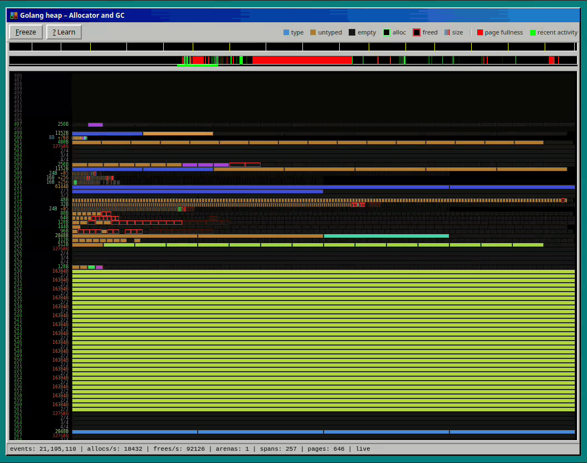

# gogc98

Visualize the work of the go allocator and GC managing the heap of a live go process. See allocations happening live and the GC reclaiming space.

Fill that void you had in your life since you couldn't watch the Windows 98 defragmenter operate anymore.



## How it works

`gogc98` is a small bridge process that polls a target Go program over
HTTP for periodic [flight recorder](https://pkg.go.dev/runtime/trace)
trace snapshots, decodes the `traceallocfree` runtime experiment's
alloc/free/span events plus GC cycle boundaries out of them, and serves
a live model of the heap over a websocket to a plain HTML/Canvas
frontend.

The target program only needs one line of instrumentation (see below)
and one environment variable — everything else runs out-of-process, so
it adds negligible overhead and can be left in production code.

## Quick start

Requires Go 1.26+.

```sh
cd demo
make run
# open http://127.0.0.1:8080
```

This builds and runs both the bundled `demo` program (an allocation
generator) and the `gogc98` bridge/visualizer against it.

## Using gogc98 in your own program

Two ways to instrument a program, from least to most invasive.

<details>
<summary><b>Option 1: import the <code>probe</code> package</b></summary>

`probe.Start()` starts an in-process flight recorder and serves its
latest snapshot over HTTP — one goroutine, no other setup.

```go
import "github.com/MichaelMure/gogc98/probe"

func main() {
    go probe.Start()
    // ... your program ...
}
```

```sh
go get github.com/MichaelMure/gogc98/probe
```

`probe` is its own Go module, separate from the bridge/visualizer —
pulling it in doesn't drag in the visualizer's own dependencies
(`golang.org/x/exp/trace`, `golang.org/x/net`), just `runtime/trace`
and `net/http` from the standard library.

The process **must** be launched with `GODEBUG=traceallocfree=1` set
in its environment — the Go runtime reads `GODEBUG` before any Go
code runs, including `init()`, so this can't be set from within the
program itself. `probe.Start()` checks for it and exits with a clear
error if it's missing.

```sh
GODEBUG=traceallocfree=1 go run .
```

Then run the bridge against it — no need to clone this repo first,
`go run` fetches and runs it directly (defaults already match
`probe.Addr`, so no flags are actually required):

```sh
go run github.com/MichaelMure/gogc98@latest -target http://127.0.0.1:7999/snapshot
```

</details>

<details>
<summary><b>Option 2: copy the minimal code</b></summary>

If you'd rather not take the dependency, this is the entire package —
paste it into your own code:

```go
import (
    "log"
    "net/http"
    "runtime/trace"
    "time"
)

func startGogc98Probe() {
    fr := trace.NewFlightRecorder(trace.FlightRecorderConfig{
        MinAge:   200 * time.Millisecond,
        MaxBytes: 8 << 20,
    })
    if err := fr.Start(); err != nil {
        log.Fatal("gogc98 probe: starting flight recorder: ", err)
    }

    mux := http.NewServeMux()
    mux.HandleFunc("/snapshot", func(w http.ResponseWriter, r *http.Request) {
        if _, err := fr.WriteTo(w); err != nil {
            http.Error(w, err.Error(), http.StatusInternalServerError)
        }
    })
    log.Print("gogc98 probe: snapshot endpoint on http://127.0.0.1:7999/snapshot")
    log.Fatal(http.ListenAndServe("127.0.0.1:7999", mux))
}
```

Run it the same way, in its own goroutine, with the same
`GODEBUG=traceallocfree=1` requirement as above:

```go
func main() {
    go startGogc98Probe()
    // ... your program ...
}
```

```sh
GODEBUG=traceallocfree=1 go run .
```

</details>

## License

MIT — see [LICENSE](LICENSE).
